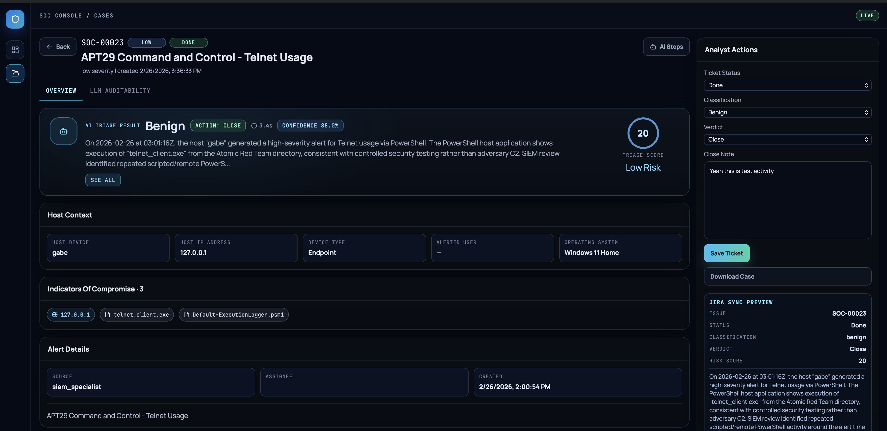
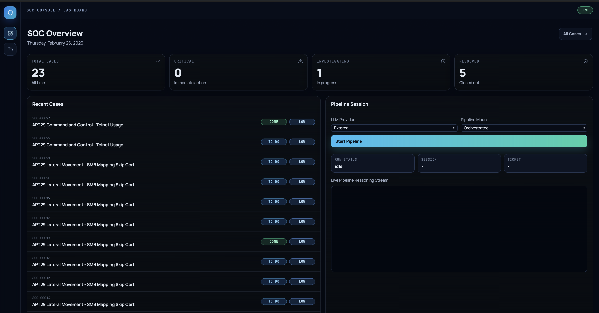

# AI Triage Agent SOC Platform (v1.04)

<p align="center">
  
</p>
<p align="center">
  
</p>

Production-oriented SOC triage system that combines deterministic guardrails with LLM-assisted investigation, then surfaces outcomes in a web UI with auditable agent/tool execution records.

## Documentation

- Engineering architecture report: [docs/reports/ENGINEERING_REPORT.md](docs/reports/ENGINEERING_REPORT.md)
- UI/UX review report: [docs/reports/UI_UX_REPORT.md](docs/reports/UI_UX_REPORT.md)
- Additional technical docs: [docs/wiki](docs/wiki)

## What This Project Delivers

- Deterministic + agentic triage workflow with explicit policy controls.
- Orchestrated multi-wave investigation (`orchestrated`) and rollback-safe legacy loop (`legacy`).
- Bounded parallel specialist execution with retries, timeouts, and idempotency protections.
- Full run artifacting for auditability (`runs/`, `pipeline_logs/`, case bundles in `cases/`).
- SOC Case UI for pipeline launch, analyst actions, comments, and closure workflow.
- Feedback loop ingestion endpoint for Jira webhook payloads into feedback storage.

## System Flow

```mermaid
flowchart LR
  %% Nodes
  A[Elastic Security Alerts] --> B[AlertIngestor + SignalEngine]
  B --> C[PreClassifier]
  C -->|close_benign/duplicate| Z1[Close Early]
  C -->|investigate| D[Context Builder + Feedback RAG]
  D --> E[IntakeAgent]
  E -->|close_benign| Z1
  E -->|investigate| F{PIPELINE_ARCH}

  F -->|orchestrated| G[SOCAnalystOrchestrator]
  G --> H[Wave 1 Specialist Actions]
  H --> I[ArtifactStore + Evidence Merge]
  I --> J{Wave Confidence Gate}
  J -->|continue| K[Wave 2 Targeted Actions]
  K --> I
  J -->|stop| L[SOC2DecisionAgent]

  F -->|legacy| M[InvestigationAgent/ReasoningAgent Loop]
  M --> N[Deterministic Planner + ToolExecutor]
  N --> O[Evidence + Scoring Updates]
  O --> P{Conclusive?}
  P -->|no| M
  P -->|yes| Q[DecisionAgent]

  L --> R[Final Classification + Action + Risk Score]
  Q --> R
  R --> S[Pipeline Logs + Run Artifacts + Audit Export]
  R --> T[SOC Case UI Ticket]
  T --> U[Analyst Actions + Comments]
  U --> V[Feedback DB Save]
  U --> W[Optional Jira Sync]
  X[Jira Webhook] --> Y[feedback_api/app.py]
  Y --> V

  %% Styling
  classDef ingest fill:#10233f,stroke:#4ea3ff,color:#d7ecff,stroke-width:1px;
  classDef control fill:#1f2430,stroke:#6b778d,color:#ecf0f8,stroke-width:1px;
  classDef agent fill:#102f24,stroke:#4cd29a,color:#d9fff1,stroke-width:1px;
  classDef output fill:#37280f,stroke:#f7b955,color:#fff2d7,stroke-width:1px;
  classDef close fill:#2f1b1b,stroke:#ff7b7b,color:#ffe1e1,stroke-width:1px;

  class A,B,X,Y ingest;
  class C,F,J,P control;
  class D,E,G,H,K,L,M,N,Q agent;
  class R,S,T,U,V,W output;
  class Z1 close;
```



## Repository Structure

- `main.py`: CLI pipeline entrypoint.
- `intake/`: Elastic ingestion, normalization, deterministic pre-classification.
- `context/`: Context building, RAG helpers, feedback retrieval.
- `agents/`: LLM-backed agents (intake, investigation, reasoning, decision).
- `orchestrator/`: Wave planner, policy bounds, specialist runner, artifact persistence.
- `tools/`, `mcp_server/`: Tool execution + specialized query/enrichment modules.
- `soc_case_ui/`: FastAPI + React SOC analyst interface.
- `feedback_api/`: Jira webhook ingestion API and persistence layer.
- `schemas/`: Shared Pydantic schemas.
- `docs/`: Architecture docs and engineering/UI reports.

## Prerequisites

- Python 3.11+ (project uses local virtualenv scripts).
- Optional Docker (for SOC UI and external Elastic stack setup).
- Accessible Elastic Security endpoint + API key.
- LLM provider configured (`local` or `external`).

## Elastic Stack Setup (Required First)

Complete Elastic environment setup before running this pipeline:

- Docker repo to use: [evermight/elastic-stack-docker-part-two](https://github.com/evermight/elastic-stack-docker-part-two)
- Official guide: [Getting started with the Elastic Stack and Docker Compose (Part 2)](https://www.elastic.co/blog/getting-started-with-the-elastic-stack-and-docker-compose-part-2)
- Video walkthrough: [Elastic setup walkthrough (YouTube)](https://www.youtube.com/watch?v=q74_FfM7sn0)

## Quick Start

### 1) Clone and bootstrap

macOS/Linux:

```bash
git clone <your-repo-url>
cd "AI-Triage-Agent v1.04 - Remote"
./scripts/setup_macos.sh
```

Windows PowerShell:

```powershell
git clone <your-repo-url>
Set-Location "AI-Triage-Agent v1.04 - Remote"
.\scripts\setup_windows.ps1
```

### 2) Configure environment

```bash
cp .env.example .env
```

Minimum required values for first run:

- `ELASTIC_BASE_URL`
- `ELASTIC_API_KEY`
- `LLM_PROVIDER`
- If `LLM_PROVIDER=external`: `EXTERNAL_LLM_URL`, `EXTERNAL_LLM_MODEL`, `EXTERNAL_LLM_API_KEY`

Recommended runtime defaults:

- `PIPELINE_ARCH=orchestrated`
- `ORCH_MAX_WAVES=2`
- `ORCH_MAX_ACTIONS_PER_WAVE=5`
- `ORCH_MAX_PARALLEL_ACTIONS=4`

### 3) Run pipeline (CLI)

macOS/Linux:

```bash
./scripts/run_pipeline_macos.sh
```

Windows PowerShell:

```powershell
.\scripts\run_pipeline_windows.ps1
```

Direct run (example):

```bash
source .venv/bin/activate
PIPELINE_ARCH=orchestrated LLM_PROVIDER=external python main.py
```

### 4) Run SOC Case UI

macOS/Linux:

```bash
./scripts/run_soc_ui_macos.sh
```

Windows PowerShell:

```powershell
.\scripts\run_soc_ui_windows.ps1
```

Open: [http://localhost:8088](http://localhost:8088)

Docker option:

```bash
cd soc_case_ui
docker compose up --build
```

## Jira Feedback Webhook (Optional)

- Endpoint: `POST /webhook/jira`
- API implementation: `feedback_api/app.py`
- DB writer: `feedback_api/db.py`

Start local webhook runtime:

```bash
source .venv/bin/activate
python -m pip install -r jira_webhook_local/requirements-webhook.txt
./jira_webhook_local/start_webhook_local.sh
```

See setup details in [jira_webhook_local/README.md](jira_webhook_local/README.md).

## Tests

```bash
source .venv/bin/activate
pytest -q
```

## Runtime Artifacts

- `pipeline_logs/`: per-agent exact input/output traces (`agent_io_*.jsonl`).
- `runs/<alert_id>/<run_id>/`: orchestrated tool outputs + metadata/events.
- `cases/`: per-ticket case bundles copied for analyst review/download.
- `audit_trail_<alert_id>.json`: legacy-style export from pipeline execution.

## GitHub Readiness and Security Notes

- Runtime caches, local DBs, case artifacts, and generated tunnel files are excluded in `.gitignore`.
- Keep `.env` uncommitted; use `.env.example` as the public template.
- Replace all placeholder secrets before running in non-local environments.
- Review `tests/fixtures/` before publishing if your organization treats sample telemetry as sensitive.
