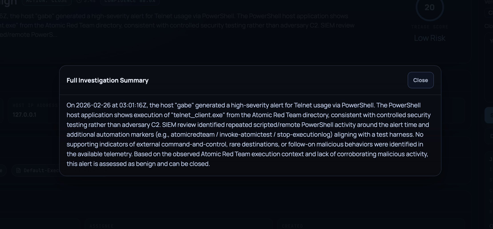
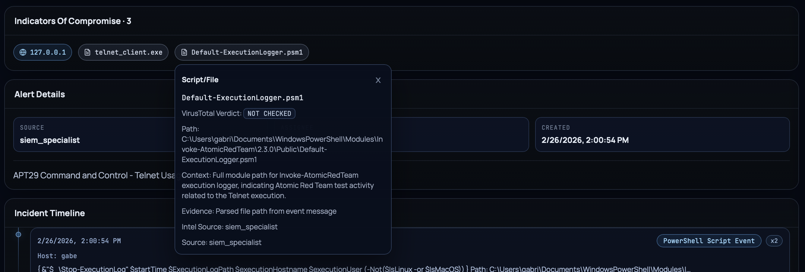
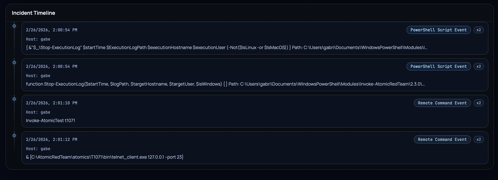
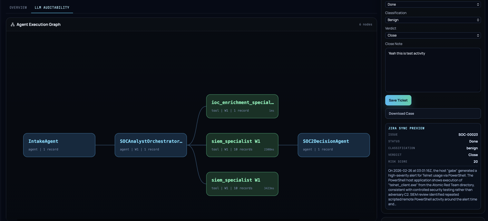
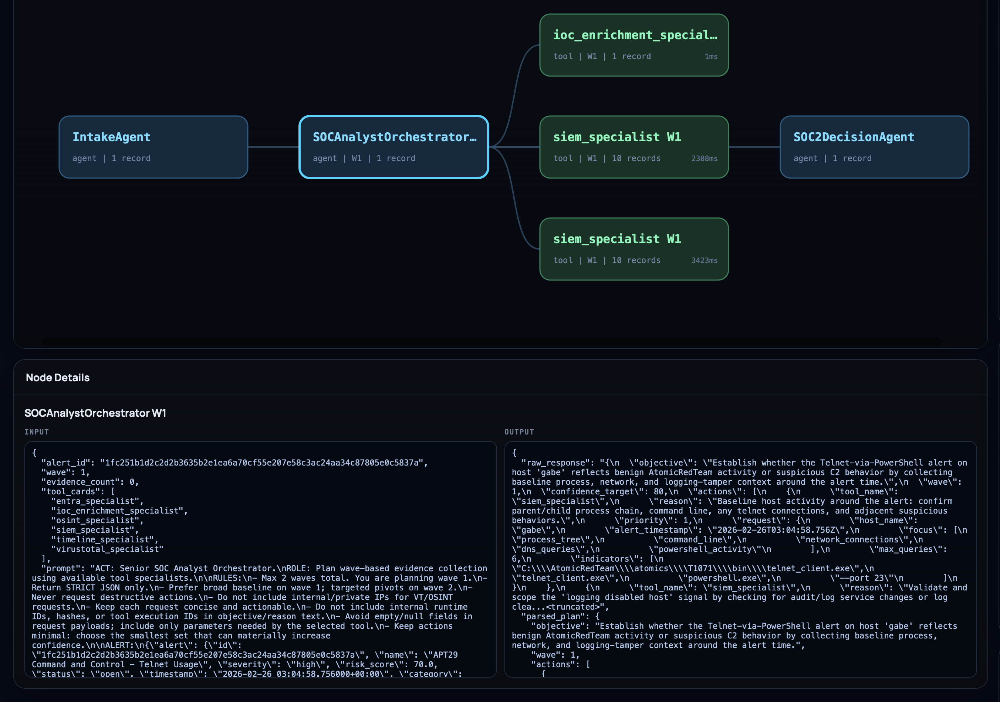
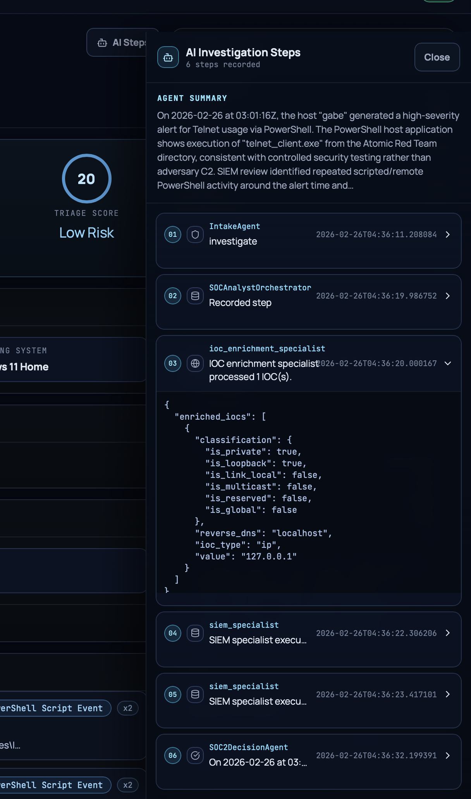
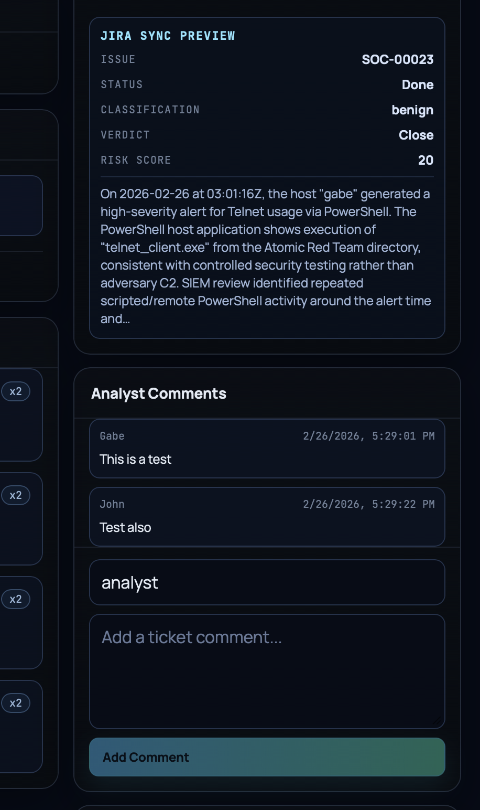

# UI/UX Report: SOC Case UI

## 1) Scope

This report reviews the current SOC Case UI experience using the latest provided screenshots in `docs/assets/screenshots/`.

Reviewed images:

- `dashboard.png`
- `screenshot-1.png`
- `incident-summary.png`
- `ioc-example.png`
- `incident-timeline.png`
- `llm-auditability.png`
- `io-view.png`
- `investigation-steps.png`
- `audit-graph.png`

## 2) Visual Evidence

## 3) Current Strengths

1. Strong SOC visual identity
- Dark command-center styling is consistent and credible for analyst workflows.
- High-importance state chips (`DONE`, `LOW`, risk score) are visually distinct.

2. End-to-end analyst workflow in one place
- Dashboard launch controls, case review, closure actions, comments, and sync preview are co-located.
- UI supports both triage execution and post-investigation handling.

3. Good auditability surface
- Dedicated `LLM AUDITABILITY` tab with execution graph is a clear trust/transparency feature.
- Node-level input/output views expose enough data for forensic review.

4. Evidence-rich case detail
- IOC chips, timeline, and structured incident summary reduce context switching.
- Analyst can inspect underlying rationale before writing close notes.

## 4) UX Risks and Friction Points

1. Dense information hierarchy on case page
- Case view combines many panels with similar visual weight.
- Important calls-to-action (save/close/sync) can be visually diluted in long pages.

2. Legibility pressure in low-contrast areas
- Some secondary text and panel dividers are close in luminance to background.
- Long-form narrative text in modal/drawer can become hard to scan quickly.

3. Responsive behavior risk (especially side panels)
- Right-side action stack appears tall and information-heavy.
- On smaller screens, analyst actions and context panels may require excessive scrolling.

4. Graph readability at scale
- Current graph is clear for small node counts.
- For larger investigations, edge routing and node clustering could become hard to parse without filtering/grouping.

## 5) Recommended Improvements (Prioritized)

1. Improve visual hierarchy in Case Detail (High)
- Increase contrast and typographic distinction between section headers, content, and metadata.
- Make primary actions (`Save Ticket`, pipeline controls) visually dominant and sticky.

2. Add collapse/filter controls for long investigations (High)
- Timeline: filter by event type/source/time range.
- Audit graph: group by wave/tool category and add quick hide/show toggles.

3. Tighten responsive breakpoints (High)
- Convert right rail to progressive disclosure on tablet/mobile.
- Preserve critical actions in a compact sticky footer/action bar.

4. Strengthen content scanning patterns (Medium)
- Break long summary text into labeled chunks (`What happened`, `Why benign/malicious`, `Decision`).
- Use consistent iconography for IOC types and event classes.

5. Add confidence/explanation affordances (Medium)
- Add short rationale helpers near classification/verdict controls.
- Show validation hints when closure fields are incomplete or contradictory.

## 6) Product Readiness Assessment

Current UI is visually mature and functionally rich for analyst-led triage with strong transparency features. To be enterprise-ready for broader teams, the highest-impact improvements are information hierarchy, responsive action ergonomics, and scalability controls for large audit/timeline datasets.
