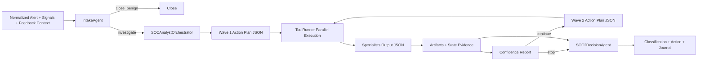

# Agent Flow (Orchestrated v2)

## Agent Responsibilities

1. `IntakeAgent`
- Decides `close_benign` vs `investigate`.
- Uses deterministic signals + feedback context.

2. `SOCAnalystOrchestrator`
- Produces strict JSON action plans.
- Chooses specialists/tools and scoped inputs.

3. `Tool Specialists`
- Execute bounded, role-specific evidence collection.
- Return structured findings + extracted IOCs.

4. `SOC2DecisionAgent`
- Consumes orchestration evidence summary and artifact references.
- Generates final close note/action without overriding deterministic score/classification.
