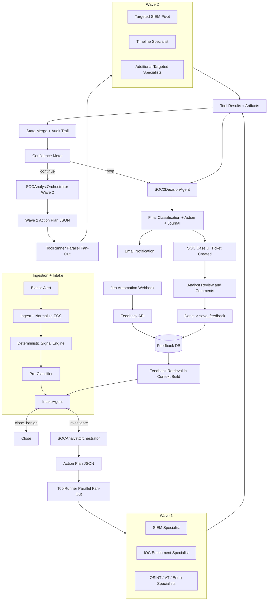

# Pipeline Deep Dive (Orchestrated v2)

This document describes the production investigation flow implemented in the current codebase.

## End-to-End Flow

## Runtime Contracts

### Orchestrator plan (`OrchestratorPlan`)
- `objective`
- `wave`
- `actions[]`
  - `tool_name`
  - `reason`
  - `priority`
  - `request` (tool-specific JSON)

### Tool result (`ToolExecutionResult`)
- `status` (`success`, `failed`, `skipped`, `denied_policy`)
- `summary`
- `request`
- `raw_result`
- `findings[]`
- `extracted_iocs`
- `artifacts[]`

## Deterministic Guardrails

- Max waves: `2`
- Max actions per wave: bounded (`ORCH_MAX_ACTIONS_PER_WAVE`)
- Max parallel actions: bounded (`ORCH_MAX_PARALLEL_ACTIONS`)
- SIEM baseline enforced in wave 1 by policy sanitizer
- Policy checks applied before tool execution
- Idempotency key blocks duplicate equivalent actions within a run

## Artifact and Audit Model

For each run:
- `runs/<alert_id>/<run_id>/meta/events.jsonl`
- `runs/<alert_id>/<run_id>/tool_results/<tool>/<action_id>.json`
- `runs/<alert_id>/<run_id>/tool_results/meta/run_metadata_*.json`
- `pipeline_logs/agent_io_<alert_id>_<timestamp>.jsonl`

This enables replay, forensic review, and per-agent/per-tool traceability.

## Specialist Inventory

Implemented specialists:
- `siem_specialist`
- `ioc_enrichment_specialist`
- `osint_specialist`
- `virustotal_specialist`
- `timeline_specialist`
- `entra_specialist`

Capability metadata and guardrails are declared in `tool_registry/cards/*.json`.

## Decisioning

`SOC2DecisionAgent` receives:
- merged evidence summaries
- artifact references
- deterministic scoring payload (`risk_score`, `classification`, `evidence_table`)

It returns structured final output (`summary`, `action`, `mitre_techniques`, `journal`) while preserving deterministic score/classification.

## SOC Case UI Workflow

`soc_case_ui` adds a ticketing frontend on top of pipeline execution:

- Start pipeline from UI (`POST /api/pipeline/start`)
- Stream live run output (`GET /api/pipeline/logs`)
- Auto-create a case ticket and case folder (`cases/<ticket_key>_*`)
- Analyst updates status, classification, verdict, close note
- On `done`, UI enforces required fields and syncs to feedback DB using `save_feedback`
- Ticket audit page reads `agent_io` and run metadata to render clickable agent/tool graph with exact I/O details
