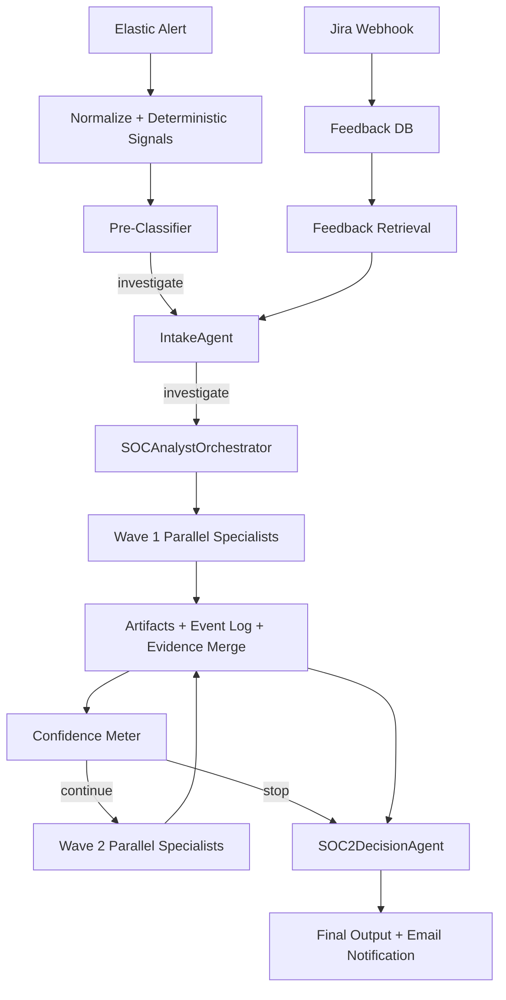

# Pipeline Summary (Orchestrated v2)

## Elastic Setup Prerequisite

Use these external references to deploy Elastic before running this pipeline:

- Docker repo: [evermight/elastic-stack-docker-part-two](https://github.com/evermight/elastic-stack-docker-part-two)
- Official article: [Getting started with the Elastic Stack and Docker Compose (Part 2)](https://www.elastic.co/blog/getting-started-with-the-elastic-stack-and-docker-compose-part-2)
- Video walkthrough: [Elastic setup walkthrough (YouTube)](https://www.youtube.com/watch?v=q74_FfM7sn0)

## Key Properties

- Two-wave max orchestration with deterministic limits.
- Tool actions are strict JSON contracts via `tool_registry/cards/*.json`.
- Parallel fan-out/fan-in inside each wave.
- Every tool call writes immutable artifact output.
- Final score/classification remain deterministic; LLM only writes close-note/action narrative.
