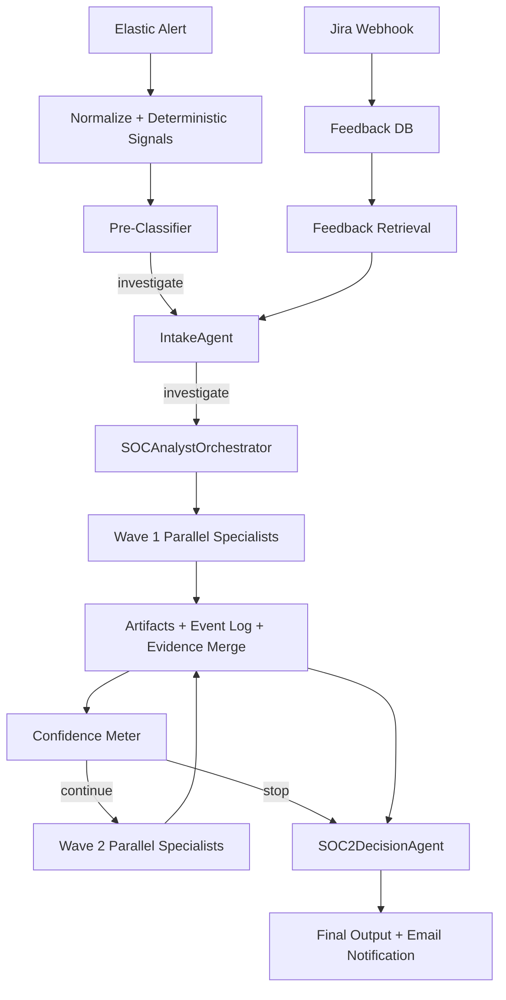

# Pipeline Summary (Orchestrated v2)

## Key Properties

- Two-wave max orchestration with deterministic limits.
- Tool actions are strict JSON contracts via `tool_registry/cards/*.json`.
- Parallel fan-out/fan-in inside each wave.
- Every tool call writes immutable artifact output.
- Final score/classification remain deterministic; LLM only writes close-note/action narrative.
