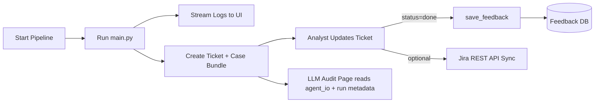

# SOC Case UI

Web interface for running the triage pipeline, reviewing cases, updating analyst decisions, and inspecting LLM/tool audit trails.

## Capabilities

- Start pipeline runs from the UI.
- Stream live pipeline output.
- Track ticket workflow: `to_do -> in_progress -> done`.
- Require closure fields before finalizing (`classification`, `verdict`, `close_note`).
- Capture analyst comments and ticket activity.
- Render LLM auditability graph with node-level I/O details.
- Package case artifacts for download.
- Optional Jira sync from ticket lifecycle updates.

## Run Locally

macOS/Linux:

```bash
./scripts/run_soc_ui_macos.sh
```

Windows PowerShell:

```powershell
.\scripts\run_soc_ui_windows.ps1
```

Open: [http://localhost:8088](http://localhost:8088)

## Frontend Build (when source changes)

Backend serves static assets from `soc_case_ui/frontend/dist`.

```bash
cd soc_case_ui/frontend
docker run --rm -v "$PWD":/work -w /work node:20-bullseye sh -lc "npm install --no-audit --no-fund && npm run build"
```

## Docker Run

```bash
cd soc_case_ui
docker compose up --build
```

Open: [http://localhost:8088](http://localhost:8088)

## Data Flow



## Notes

- Feedback sync uses the same backend DB path as webhook ingestion.
- Default UI DB: `soc_case_ui/soc_ui.db` (created automatically).
- Default case bundle directory: `cases/`.
- Jira sync controls:
  - `JIRA_SYNC_ENABLED`
  - `JIRA_SYNC_REQUIRED`
